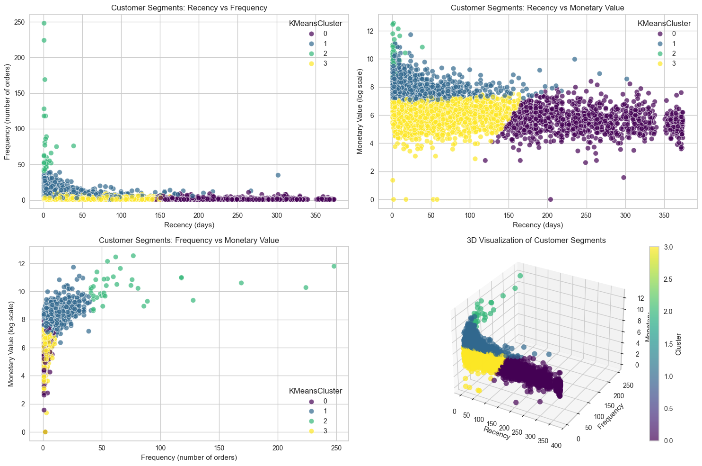
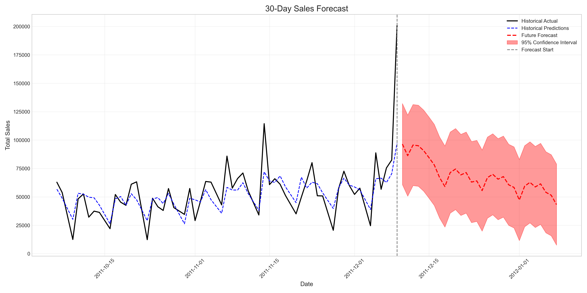

# Applied Machine Learning on UCI Online Retail Dataset

This repository compares machine learning algorithms using the [Online Retail dataset](https://archive.ics.uci.edu/dataset/352/online+retail) from UCI ML Repository.

## Data

The used data is a transactional dataset which contains all the transactions occurring between 01/12/2010 and 09/12/2011 for a UK-based and registered non-store online retail.The company mainly sells unique all-occasion gifts. Many customers of the company are wholesalers.

The dataset contains following features:

- **InvoiceNo:** A 6-digit integral number uniquely assigned to each transaction. If this code starts with letter 'c', it indicates a cancellation.
- **StockCode:** A 5-digit integral number uniquely assigned to each distinct product.
- **Description:** Product (item) name.
- **Quantity:** The quantities of each product (item) per transaction.
- **InvoiceDate:** The day and time when each transaction was generated.
- **UnitPrice:** Product price per unit in sterling.
- **CustomerID:** A 5-digit integral number uniquely assigned to each customer.
- **Country:** The name of the country where each customer resides.

## Example plots

### Clustering customers by recency, frequency and monetary value (RFM)

### T-SNE plot of product description embeddings embeddings

### Sales forecasting

